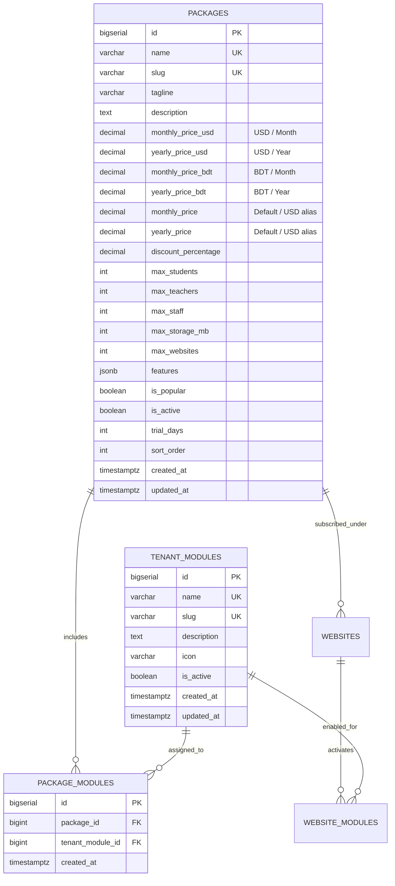

# Implementation Plan: Multi-Currency Package Pricing & Tenant Modules Architecture

## 1. Executive Summary & Objective

The goal is to update the SaaS platform's package management system:
1. **Schema Update (`psql/schema.psql`)**:
   - Update Table 8 (`packages`) to include independent **BDT (৳)** and **USD ($)** pricing for both **monthly** and **yearly** subscription billing cycles (`monthly_price_bdt`, `yearly_price_bdt`, `monthly_price_usd`, `yearly_price_usd`), along with institutional school quotas (`max_students`, `max_teachers`, `max_staff`, `max_storage_mb`, `tagline`, `features`).
   - Add database migration/compatibility queries (`ALTER TABLE packages ADD COLUMN IF NOT EXISTS ...`).
   - Seed standard educational **Tenant Modules** into Table 9 (`tenant_modules`).
2. **Backend API Layer**:
   - Create a dedicated Developer Tenant Modules endpoint: `src/app/api/marketing/developer/tenant-modules/route.js` (with automatic catalog seeding fallback).
   - Upgrade Developer Packages API: `src/app/api/marketing/developer/packages/route.js` and `[slug]/route.js` to:
     - Remove mandatory `app_id` blocking.
     - Store and retrieve the 4 pricing columns (`monthly_price_usd`, `yearly_price_usd`, `monthly_price_bdt`, `yearly_price_bdt`).
     - Link and synchronize packages with Table 10 (`package_modules`) referencing `tenant_modules(id)`.
     - Return detailed `tenant_modules` objects and `tenant_module_ids` in queries.
3. **Developer Panel Frontend**:
   - Overhaul `src/component/marketing/developer/forms/PackageForm.jsx`:
     - Implement 4 dedicated pricing inputs (USD Monthly/Yearly & BDT Monthly/Yearly).
     - Remove obsolete required application dropdown blocker.
     - Add institutional capacity fields (`max_students`, `max_teachers`, `max_staff`, `max_storage_mb`, `tagline`, `trial_days`, `is_popular`).
     - Build an interactive **Tenant Modules Picker** showing all cataloged tenant features (SIS, Attendance, LMS, Exams, Fees, Payroll, Routine, etc.) with real-time selection and bulk actions.
   - Upgrade `src/app/(developers)/developer/packages/page.jsx`:
     - Display dual-currency pricing (USD & BDT) in list tables and KPI cards.
     - Display linked tenant module tags.
     - Enhance quick-create handler.
   - Upgrade `src/app/(developers)/developer/packages/[slug]/page.jsx` for full package edit lifecycle.

---

## 2. Architecture & Database Design

### 2.1 Database Schema (`psql/schema.psql`)



### 2.2 Table Definitions to Update in `psql/schema.psql`

```sql
-- 8. PACKAGES TABLE (Subscription Pricing Plans for Educational Institutions / SaaS)
CREATE TABLE IF NOT EXISTS packages (
    id BIGSERIAL PRIMARY KEY,
    name VARCHAR(100) UNIQUE NOT NULL,
    slug VARCHAR(100) UNIQUE NOT NULL,
    tagline VARCHAR(255),
    description TEXT,
    monthly_price_usd DECIMAL(12, 2) NOT NULL DEFAULT 0.00 CHECK (monthly_price_usd >= 0.00),
    yearly_price_usd DECIMAL(12, 2) NOT NULL DEFAULT 0.00 CHECK (yearly_price_usd >= 0.00),
    monthly_price_bdt DECIMAL(12, 2) NOT NULL DEFAULT 0.00 CHECK (monthly_price_bdt >= 0.00),
    yearly_price_bdt DECIMAL(12, 2) NOT NULL DEFAULT 0.00 CHECK (yearly_price_bdt >= 0.00),
    monthly_price DECIMAL(12, 2) NOT NULL DEFAULT 0.00 CHECK (monthly_price >= 0.00),
    yearly_price DECIMAL(12, 2) NOT NULL DEFAULT 0.00 CHECK (yearly_price >= 0.00),
    discount_percentage DECIMAL(5, 2) DEFAULT 0.00 CHECK (discount_percentage >= 0.00 AND discount_percentage <= 100.00),
    max_students INT DEFAULT 500,
    max_teachers INT DEFAULT 30,
    max_staff INT DEFAULT 20,
    max_storage_mb INT DEFAULT 5120,
    max_websites INT DEFAULT 1,
    features JSONB DEFAULT '[]'::jsonb,
    is_popular BOOLEAN DEFAULT FALSE,
    is_active BOOLEAN DEFAULT TRUE,
    trial_days INT DEFAULT 14,
    sort_order INT DEFAULT 0,
    created_at TIMESTAMPTZ DEFAULT CURRENT_TIMESTAMP,
    updated_at TIMESTAMPTZ DEFAULT CURRENT_TIMESTAMP
);

-- Idempotent Migration for Existing Live Databases
ALTER TABLE packages ADD COLUMN IF NOT EXISTS monthly_price_usd DECIMAL(12, 2) NOT NULL DEFAULT 0.00;
ALTER TABLE packages ADD COLUMN IF NOT EXISTS yearly_price_usd DECIMAL(12, 2) NOT NULL DEFAULT 0.00;
ALTER TABLE packages ADD COLUMN IF NOT EXISTS monthly_price_bdt DECIMAL(12, 2) NOT NULL DEFAULT 0.00;
ALTER TABLE packages ADD COLUMN IF NOT EXISTS yearly_price_bdt DECIMAL(12, 2) NOT NULL DEFAULT 0.00;
ALTER TABLE packages ADD COLUMN IF NOT EXISTS max_websites INT DEFAULT 1;

-- 9. TENANT MODULES CATALOG SEED
INSERT INTO tenant_modules (name, slug, description, icon, is_active) VALUES
('Student Information System (SIS)', 'sis', 'Complete student profiles, enrollment, records, and student ID management', 'BiUser', true),
('Attendance Tracker', 'attendance', 'Daily automated student & staff attendance with SMS alerts and biometric support', 'BiCalendarCheck', true),
('Examinations & Report Cards', 'exams', 'Exam scheduling, question banks, online marks entry, and automated report cards', 'BiAward', true),
('LMS & Study Materials', 'lms', 'Digital syllabus, lecture notes, homework submission, and online video classes', 'BiBookOpen', true),
('Fees & Online Collections', 'fees', 'Tuition fee voucher generation, bKash/Nagad/Cards online payment gateway integration', 'BiCreditCard', true),
('Accounting & Financial Ledger', 'accounting', 'Institutional accounting, income/expense tracking, ledger, and balance sheets', 'BiLineChart', true),
('Staff & Payroll Management', 'staff-payroll', 'Teacher/employee profiles, leave management, monthly payroll and payslips', 'BiGroup', true),
('Routine & Class Scheduling', 'routine', 'Weekly dynamic routine generator, period management, and teacher load allocation', 'BiTime', true),
('Notice & Broadcast System', 'notices', 'Instant school broadcast notices, SMS/email announcements to parents', 'BiBell', true),
('Hostel & Dormitory', 'hostel', 'Hostel room allocations, fee tracking, and hostel warden logs', 'BiBuilding', true),
('Transport & Fleet Tracking', 'transport', 'Vehicle routes, stops, driver contacts, and student transport fees', 'BiBus', true),
('Public Institutional Website', 'website-builder', 'Dynamic frontend CMS, school landing page, about, achievements, and gallery', 'BiDesktop', true)
ON CONFLICT (slug) DO NOTHING;
```

---

## 3. Step-by-Step Implementation Steps

### Phase 1: Database Schema & Seed (`psql/schema.psql`)
- **Action**: Edit `psql/schema.psql` Table 8 (`packages`) to define the four currency columns:
  - `monthly_price_usd`
  - `yearly_price_usd`
  - `monthly_price_bdt`
  - `yearly_price_bdt`
  - Keep `monthly_price` and `yearly_price` for fallback compatibility.
  - Add `max_websites INT DEFAULT 1`.
  - Append initial seed insert for `tenant_modules` and migration `ALTER TABLE` statements.

### Phase 2: Tenant Modules API Route
- **Action**: Create new route `src/app/api/marketing/developer/tenant-modules/route.js`.
  - **GET**: Queries `SELECT * FROM tenant_modules WHERE is_active = TRUE ORDER BY id ASC`. If empty, automatically seeds default modules and returns them.
  - **POST**: Allows developer administrators to create custom tenant modules if needed.

### Phase 3: Packages API Routes (`route.js` and `[slug]/route.js`)
- **Action**: Update `src/app/api/marketing/developer/packages/route.js`:
  - **GET**:
    - Select package fields including all 4 pricing tiers.
    - Aggregate linked tenant modules via `package_modules` JOIN `tenant_modules`.
    - Also aggregate array of IDs `tenant_module_ids` for rapid checkbox matching.
  - **POST**:
    - Remove obligatory `app_id` requirement (make optional).
    - Parse `monthly_price_usd`, `yearly_price_usd`, `monthly_price_bdt`, `yearly_price_bdt`, `tagline`, `max_students`, `max_teachers`, `max_staff`, `max_storage_mb`, `max_websites`, `features`, `trial_days`, `is_popular`, `is_active`.
    - Insert package row.
    - Synchronize `package_modules`:
      - Accept `tenant_module_ids` array.
      - Perform bulk `INSERT INTO package_modules (package_id, tenant_module_id) VALUES (...) ON CONFLICT DO NOTHING`.
      - For backward compatibility with legacy consumers, also sync `allowed_modules`.
  - **PUT**:
    - Update all price columns and quota metrics.
    - Clear and re-insert `package_modules` for the package ID.
- **Action**: Update `src/app/api/marketing/developer/packages/[slug]/route.js` to match the same logic for slug-based fetching and updating.

### Phase 4: Developer Panel UI Components
- **Action**: Refactor `src/component/marketing/developer/forms/PackageForm.jsx`:
  1. Remove required `app_id` dependency and select dropdown.
  2. Implement **Multi-Currency Pricing Grid** (USD Monthly, USD Yearly, BDT Monthly, BDT Yearly) with clear currency symbols (`$` and `৳`) and helpful helper text.
  3. Implement **School Capacity / Limits Grid**:
     - Max Students
     - Max Teachers
     - Max Staff
     - Max Storage (MB)
     - Max Websites
     - Trial Period (Days)
     - Tagline
     - Is Popular Plan Badge Toggle
  4. Implement **Tenant Modules Linkage Grid**:
     - Fetch `tenant_modules` list from `/api/developer/tenant-modules`.
     - Render selectable cards for each module displaying icon, title, and short description.
     - Actions: "Select All", "Deselect All", and live counter ("X of Y modules linked").
     - On submit, pass `tenant_module_ids`.

- **Action**: Update `src/app/(developers)/developer/packages/page.jsx`:
  - Table columns to show:
    - Package Tier & Tagline
    - USD Pricing: `$XX.XX/mo` and `$YYY.YY/yr`
    - BDT Pricing: `৳XXXX/mo` and `৳YYYYY/yr`
    - Quotas: Students, Teachers, Staff, Storage
    - Linked Tenant Modules: Badges showing module names with `+N more` popover/badge
    - Active/Disabled toggle and Action buttons
  - Quick-create handler provisions clean defaults for BDT/USD and links default modules.

---

## 4. Verification & Testing Checklist

1. [ ] **Schema Integrity**: Validate `psql/schema.psql` syntax and column definitions.
2. [ ] **Tenant Modules API**: Call `/api/developer/tenant-modules` to ensure it returns the active list of school modules with auto-seeding.
3. [ ] **Package Creation API**: Send POST request to `/api/developer/packages` with USD & BDT prices and `tenant_module_ids`; verify database record in `packages` and `package_modules`.
4. [ ] **Package Edit & Sync**: Update package prices and toggle tenant modules; verify `package_modules` reflects additions and deletions.
5. [ ] **UI Validation**: Open Developer Panel -> Packages (`/developer/packages`):
   - Verify table displays USD and BDT prices correctly.
   - Click "Create Package" or edit an existing package; verify all 4 price fields and tenant module selection grid work seamlessly.
